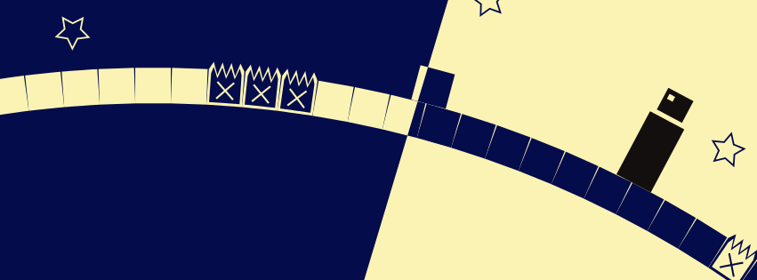

# Cycle

HTML5 game made with Phaser

## Run locally

1. Clone the repository: `git clone https://github.com/cycle-game/Cycle.git`
2. Install dependencies: `yarn install`
3. Start Webpack dev server: `yarn start:dev`

## Deploy in firebase

Run `yarn firebase deploy`
Go in https://cycle-3677e.web.app

## Level contributors

-   Alexis Busin
-   Arnaud Thevenard
-   Dany Humbert
-   Raphaël Rothmann
